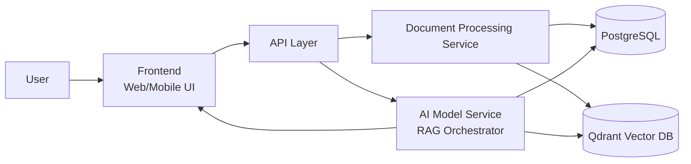
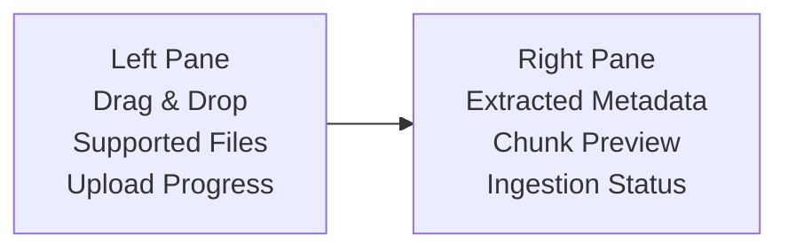
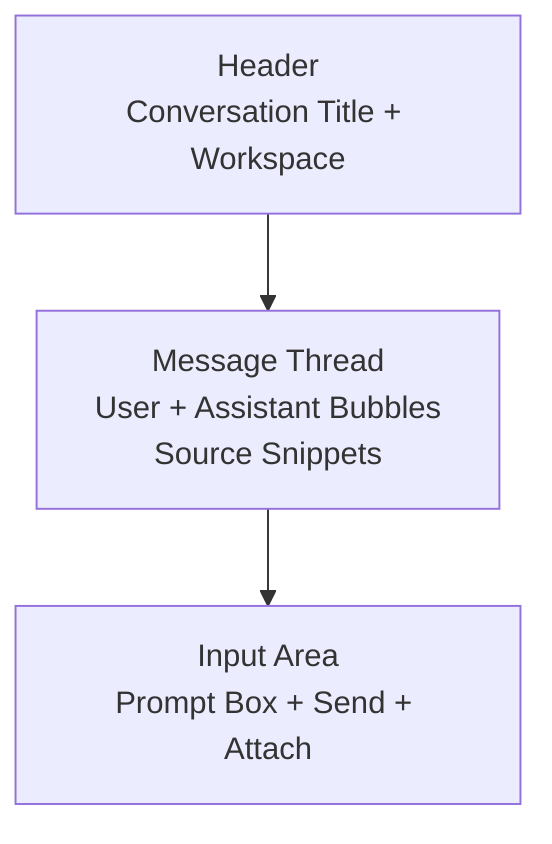
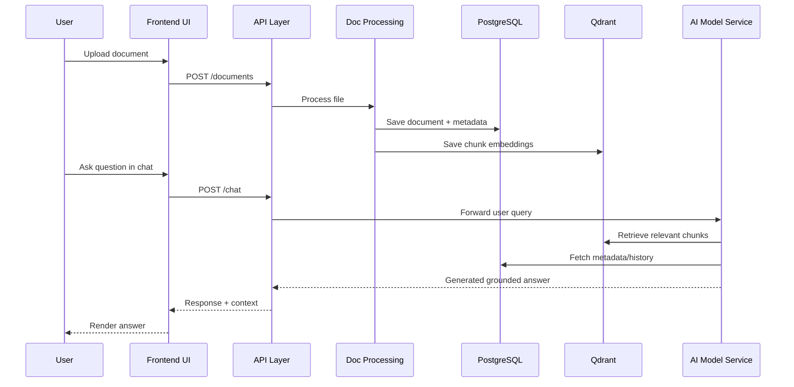
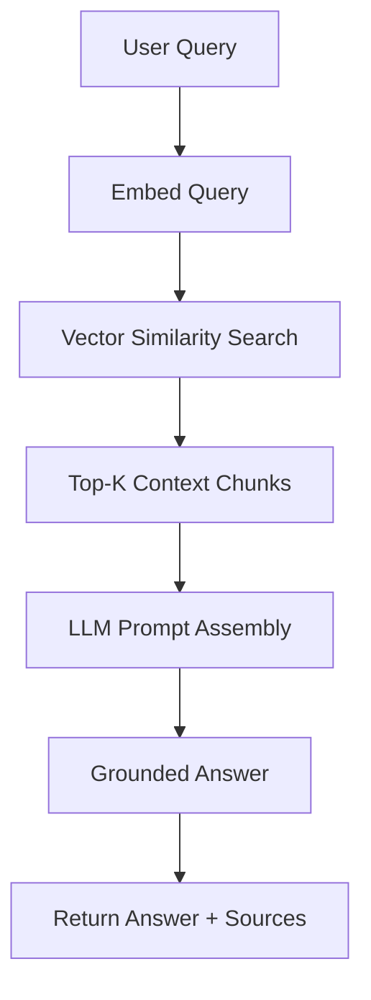
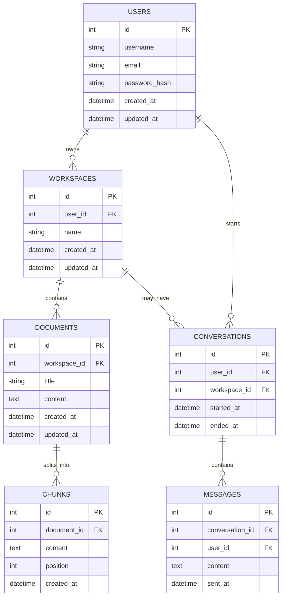

<<<<<<< HEAD
<div align="center">

# 🚀 AI Knowledge Platform — RAG Course

### Retrieval-Augmented Generation (RAG) System with Document Upload, Hybrid Search, and Conversational AI


</div>

---

## ✨ Executive Summary

This repository presents a complete blueprint for an **AI Knowledge Platform** built on **Retrieval-Augmented Generation (RAG)** principles.
It combines:

- A user-friendly frontend for document upload and chat.
- A backend API for orchestration.
- A retrieval + generation AI pipeline.
- A structured PostgreSQL schema for product data.
- A vector search layer (Qdrant) for semantic retrieval.

The goal is to deliver answers that are **context-aware, traceable, and scalable** for real-world knowledge workflows.

---

## 🧭 Table of Contents

- [✨ Executive Summary](#-executive-summary)
- [🏗️ System Architecture](#️-system-architecture)
- [🖼️ Wireframes (UI Blueprint)](#️-wireframes-ui-blueprint)
- [🔄 Workflow Diagrams](#-workflow-diagrams)
- [🧱 Data Architecture](#-data-architecture)
- [🛠️ Implementation Guide](#️-implementation-guide)
- [🔐 Security](#-security)
- [📈 Scalability Notes](#-scalability-notes)
- [✅ Why This Project Stands Out](#-why-this-project-stands-out)

---

## 🏗️ System Architecture

### Core Components



### Functional Breakdown

- **Frontend**
  - User interface for uploads and chat.
  - Real-time conversational experience.
- **API Layer**
  - Entry point for frontend requests.
  - Routes calls to processing and AI services.
- **Document Processing Service**
  - Extracts and normalizes text.
  - Splits content into chunks and stores metadata.
- **AI Model Service (RAG)**
  - Retrieves relevant chunks.
  - Generates grounded responses.
- **Storage Layer**
  - PostgreSQL for transactional and relational data.
  - Qdrant for vector embeddings and similarity search.

---

## 🖼️ Wireframes (UI Blueprint)

> Simple wireframe-style layouts to communicate product direction quickly.

### 1) Landing + Workspace

```mermaid
flowchart TB
    subgraph App Shell
      A[Top Nav\nLogo | Workspaces | Profile]
      B[Sidebar\n- Uploads\n- Documents\n- Conversations\n- Settings]
      C[Main Content\nWorkspace Overview\nRecent Docs + Recent Chats]
    end
    A --> B
    A --> C
```

### 2) Document Upload Screen



### 3) Chat Experience Screen



---

## 🔄 Workflow Diagrams

### End-to-End Data Flow



### Retrieval + Generation Logic



---

## 🧱 Data Architecture

### PostgreSQL Entity Relationship Diagram



### Vector Database (Qdrant) Collections

- **Document Embeddings**
  - `id` (UUID)
  - `embedding` (vector)
  - `metadata` (JSON)
- **Chunk Embeddings**
  - `id` (UUID)
  - `document_id` (UUID)
  - `embedding` (vector)
  - `metadata` (JSON)

---

## 🛠️ Implementation Guide

<details open>
<summary><strong>1) Setup</strong></summary>

### Prerequisites
- Node.js
- Python
- Docker

### Bootstrap
```bash
git clone https://github.com/emxelux/ChatPDF.git
cd ChatPDF
```

### Frontend Install
```bash
cd frontend
npm install
```

### Backend Install
```bash
cd backend
pip install -r requirements.txt
```
</details>

<details>
<summary><strong>2) Dependencies</strong></summary>

- **Frontend:** React, Axios
- **Backend:** Flask, SQLAlchemy
</details>

<details>
<summary><strong>3) Configuration</strong></summary>

### Frontend `.env`
```env
REACT_APP_API_URL=http://localhost:5000/api
```

### Backend Config
Set database connection values inside `backend/config.py`.
</details>

<details>
<summary><strong>4) Code Patterns</strong></summary>

### Frontend API Call
```javascript
import axios from 'axios';

const fetchData = async () => {
  const response = await axios.get(`${process.env.REACT_APP_API_URL}/data`);
  console.log(response.data);
};
```

### Backend Endpoint
```python
from flask import Flask, jsonify

app = Flask(__name__)

@app.route('/api/data', methods=['GET'])
def get_data():
    return jsonify({'data': 'Hello World!'})
```

### Document Ingestion
```python
with open('document.txt') as f:
    content = f.read()
    # Process content here
```

### Indexing (Example)
```bash
curl -X POST "http://localhost:9200/my_index/_doc/1" -H 'Content-Type: application/json' -d '{ "content": "Document content here" }'
```

### Retrieval (Example)
```bash
curl -X GET "http://localhost:9200/my_index/_search?q=document"
```

### Agent Skeleton
```python
class DataAgent:
    def query_data(self):
        # Query logic here
```
</details>

---

## 🔐 Security

- **Authentication** before system access.
- **Encryption** for data in transit and at rest.
- **Input validation** to mitigate injection and malformed payload attacks.

---

## 📈 Scalability Notes

- Index foreign keys in PostgreSQL for better relational query performance.
- Use vector indexes in Qdrant for low-latency semantic retrieval.
- Decouple ingestion and retrieval services for horizontal scaling.
- Keep chat history and metadata structured for auditability and personalization.

---

## ✅ Why This Project Stands Out

- End-to-end RAG blueprint (UI → API → Retrieval → Generation).
- Production-minded data model spanning relational + vector storage.
- Clear onboarding path with setup and implementation snippets.
- Visual-first documentation with architecture, wireframes, and workflow diagrams.

---

<div align="center">

### Built for modern AI product engineering interviews and real-world delivery.

</div>
=======
---
title: Chatpdf
emoji: ⚡
colorFrom: red
colorTo: red
sdk: gradio
sdk_version: 6.12.0
app_file: app.py
pinned: false
short_description: This is my AI Rag system project.
---

Check out the configuration reference at https://huggingface.co/docs/hub/spaces-config-reference
>>>>>>> 8295253039b6cbfb540bd372bafb2427af962082
